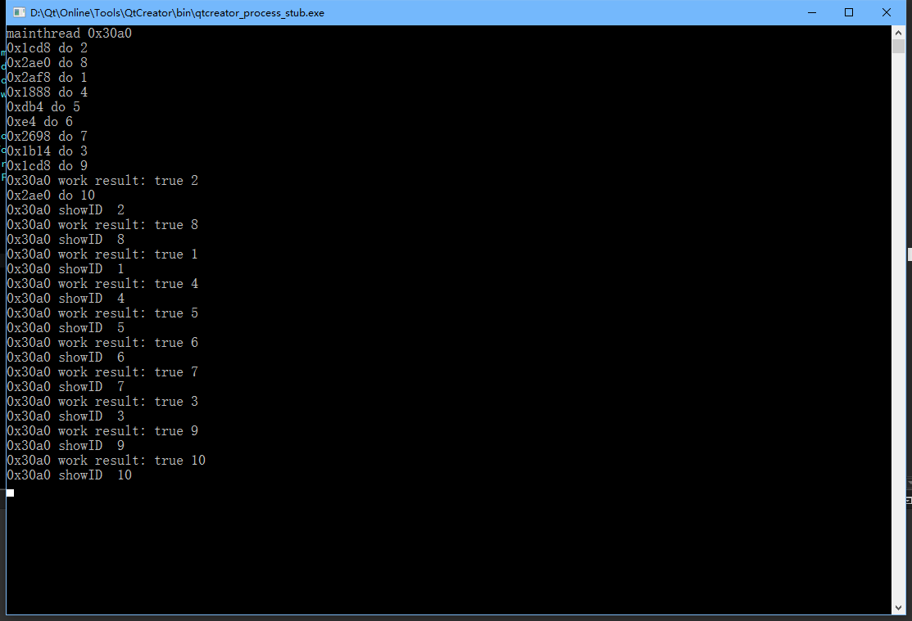

对Qt QThread的简单封装。

Qt的线程有两种场景。

如果是比较独立的任务，不需要交互的，直接QThread::run, 或者QRunable, QtConcurrent都可以。

如果是要交互的，就得QObject moveToThread，或者别的什么事件机制的写法。有交互的情况下，如果用前面的那几种，得自己管事件循环，不然会把UI卡住。

而我这种signal(lambda)的玩法，不会卡住UI，还能像run一样方便。


--

2019/6/13更新 

前面那种方式删掉了，因为有局限，不方便复用。

改成线程池了，更加好用。

直接调用封装好的 ThreadPool::getInstance()->work() 函数即可，传递两个lambda作为参数。
第一个lambda是线程池里运行的任务。需要返回任务结果为true 或者false。
第二个lambda是任务结束后，在主线程执行的任务。带一个bool参数为任务的执行结果。
```C++
ThreadPool::getInstance()->work(
                [id](){
                    qWarning() << QThread::currentThreadId() << "do" << id;
                    return true;
                },
                [this, id](bool result){
                    qWarning() <<QThread::currentThreadId() << "work result:" << result << id;
                    showId();
                });
```
